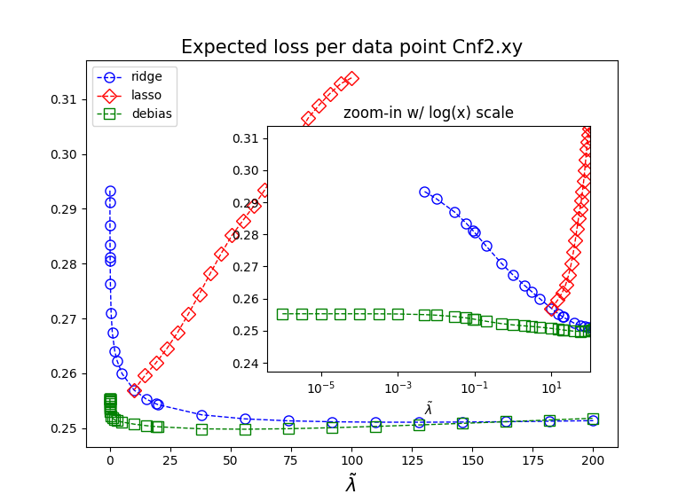
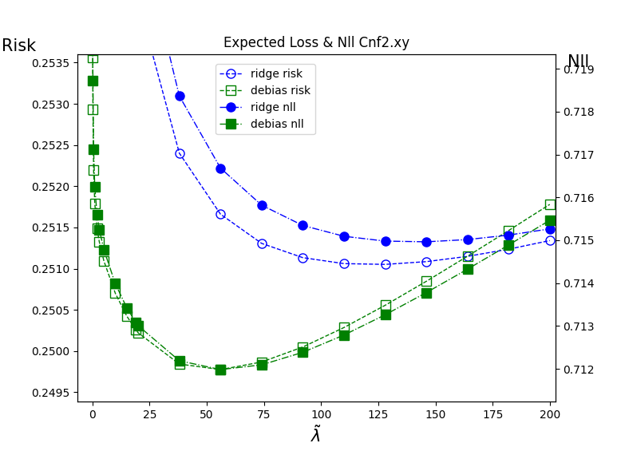
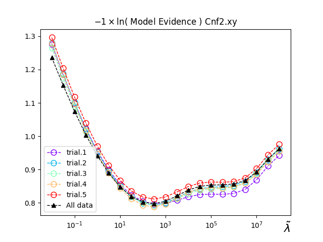
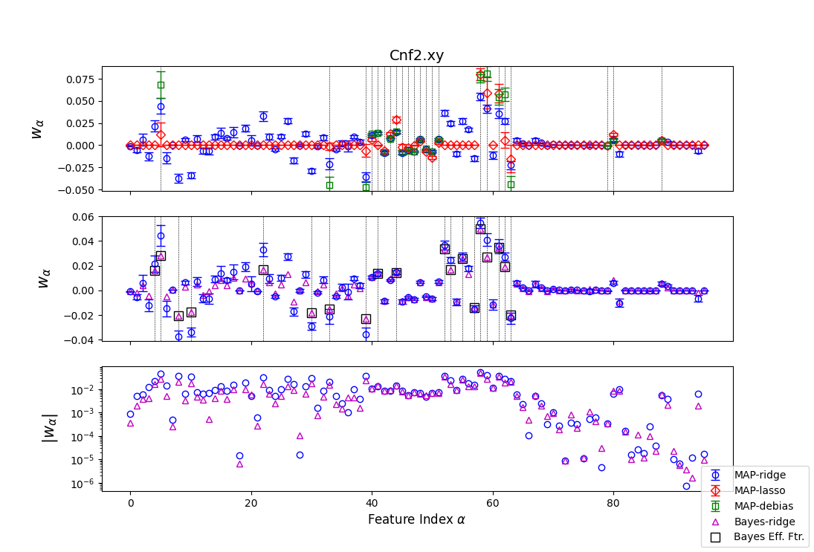
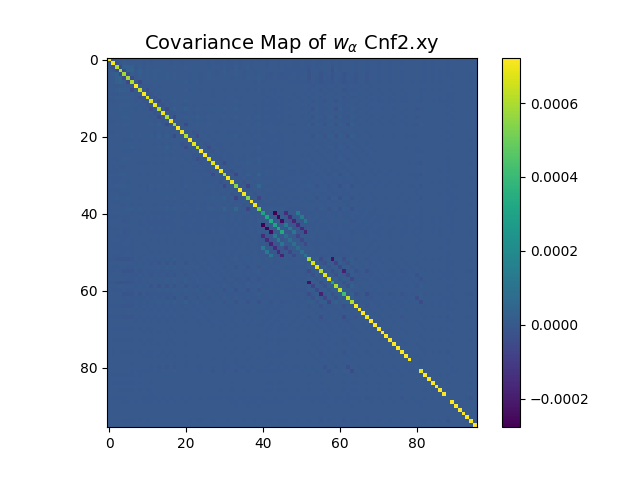
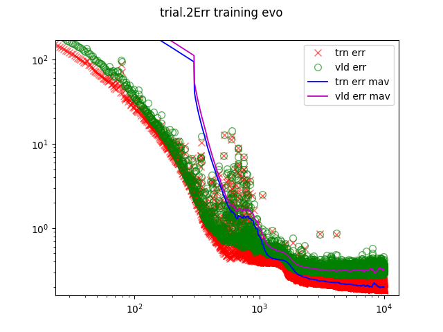
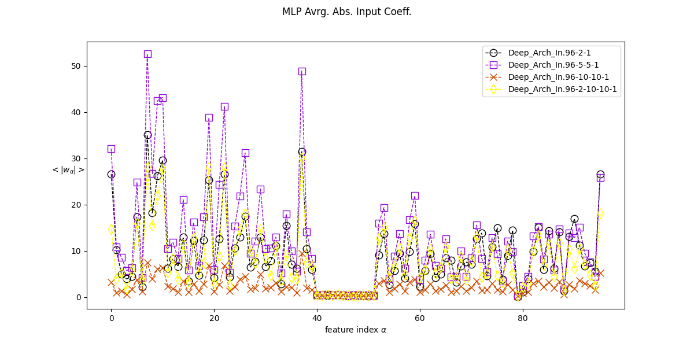
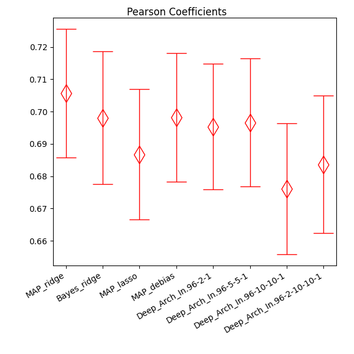

# Structure and Dynamics in Glasses - a Machine Learning approach

## Introduction

The intrigueing behaviour of glassy materials remains a major challenge of statistical physics for decades yet to be demystified.
This mini-project showcases the application of supervised machine learning techniques to an active research area of this domain of physics, namely the study of the relation between microscopic structure and heterogeneous dynamical features in glassy materials.
From a practical perspective, we search an approximation of some unknown, allegedly existing, target function $\varphi(\cdot)$ that maps the local structural environment of a molecule at an arbitrary instance to its travelled distance at a later instance. The local structure enviornment of a molecule is quantified by a $M$ dimensional vector $` \mathbf{x} `$, the components of which are so-called "structure descriptors", and the distance travelled is quantified by a scalar $p$, conventionally called "propensity", measuring the mean-squared-displacement over a purposefully chosen duration of that molecule. Hence, the core practice of this project is to feed machine learning models with input-output pairs $` (\mathbf{x}, p) `$  to aquire the target function $` \varphi(\mathbf{x}) = p `$.

Unlike usual applications fo machine learning, the primary purpose here is not for predicting a molecule's movement based on unseen structural data. The significance is two fold. First, the best generalisation performance that can be achieved by any machine learning approaches itself concept-proves whether the salient dynamical behaviours of glassy materials is actually related to its "featureless" structural. The potential success shall clearly indicate that comprehending deeply information encoded in the structure is a promising direction of glass research. Second, with the approach adopted in this project, one can also expect concrete assessement of which type of structure descriptors (i.e. which features of $` \mathbf{x} `$) are relevant to the dynamics. This shall further narrow the scope of future study on this topic.

Linear regression models and multi-layer perceptrons (MLP neuron-network) are the machine learning models to be studied in this project. Linear regression models have the advantage to be interpretable, provding valuable information for physics. While MLP is not quite interpretable, it is an universal approximator with two benefits. First, by tuning the model flexibility through varying its architecture, one can eventually detect the upper bound of generalisation performance in guessing $\varphi(\cdot)$, which hints the adequacy of assuming such a targect function in first place. Second, with that a linear model can be viewed as a special case of MLP of the least complexity, by comparing the performance of MLP with a linear model, it would become clear to which extend, within the scope of our approach, the physical insights gained from an interpretable linear model are valid.

To gain a more complete presentation of the physics context, please refer to the section ["Problem context"](/README.md#problem-context). Otherwise, skip it to directly dive into the showcase of the machine learning application. The results here presented are generated by python programs and data enclosed in [project](./project/), together with an explatory document [explain.ipynb](./project/explain.ipynb). Python programs should be run from the directory [project](./project/) for loading and saving data correctly with relative paths.

## Problem Context

We are dealing with a problem in an active area of current research in statistical physics of glassy materials. A type of material, such as $\text{SiO}_2$, is glassy when the crystallisation (or more generally called the first order transition, such as water becoming ice) is avoided, bypassed or absent with a changing of its environment, usually a dropping temperature. Instead, these materials vitrify, that is they behave like a liquid but becoming more and more viscous with a decreasing temperature until at some point, they apparently stop flowing and stand there like a solid, which we call glasses. This apparent transition from a liquid to a "solid", allegedly call the "glass transition", is unconventional compared to crystallisation where the microscopic structure changes qualitatively from a disordered one of liquids to an ordered structure of crystals, like FCC, BCC, etc. In a glass transition, the microscopic structure is always disordered seemingly unchanged from a liquid, except that molecules have more and more difficulties to move under thermal aggitation, giving rise to its macroscopic drastic increase in viscosity, so large they apperently stop flowing. Physicists havn't come up with a proper explaination of this phenomenon using elementary concepts and hypothesis in physics for more than half a centry, although splended progress has been made.

Accompanying this dynamical slowing down in a glass transition, molecules move also more and more unevenly over locations and periods (space and time), a phenomenal called "dynamical heterogeneity". It basically states the fact that while particles at some places significantly wonder around over a period of time, particles at some other places vibrate in place like struggling to get out of their cages, and the fact that while any particle could be free to move for some periods of time, the same particle stucks over some other periods of time. This dynamical complexity has a central role in decyferring the glass transition as it is a signature of glassy dynamics.
It has been shown by computer simulations that the levels of mobitiy of particles across an entire system over certain period of time starting from a given moment, say $t=0$, is largely decided only by the configuration at that moment $t=0$. A configuration is specified by the positions of particles in the entire system, denoted $` \{\mathbf{R}_i\}_{1,2,\ldots,N} `$, and the mobility of a particle $i$ is characterized by a quantity called "propensity", denoted $p_i$, where $N$ the number of particles in a system. There are several definitions of propensity used in the literature, but the one we are using here is simply the statistical average of the distance being trevalled by a particle over a duration $\tau_\alpha$, that is the time scale over which the configuration has been significantly changed and directly related with the macrosopic viscosity. Hence the propensity is a positive scalar associated with some particle. An example of molecules' propensity coming from an earlier configuration is illustrated in [Fig.1](/README.md#fig1), generated with ["particle_clustering.py"](./project/PyCode/particle_clustering.py).

#### Fig.1
<picture>
    
</picture>

The strong link between a configuration and the propensity, as evidenced by numerical experiments, indicates that a careful characterisation of this relation may pave the way in demystifying the glass transition. By "careful characterisation", we look for the information encoded in a configuration that is actually relevant to the propensity. A configuration, represented by $` \{\mathbf{R}_i\}_{1,2,\ldots,N} `$, is raw data containing both relevant and irrelevant information for our problem. To name one type of irrelevant information, consider translation of the entire system, which gives rise to a new list $` \{\mathbf{R}'_i\}_{1,2,\ldots,N} `$, but does not affect the propensity of any particle, as implied by the translation invariance of physical laws. The approach we are following in this project, as a physicists' tradition, is to measure physically motivated structure descriptors for each particle based on the relative positions of its surrounding particles. Beacause of the lack of prior knowledge, we include many ($M=96$) structure descriptors for each particle to form a list of structure descriptors $` \{\mathbf{x}_i\}_{i=1,2,\ldots,N} `$ with each $` \mathbf{x}_i \in \mathbb{R}^M `$. The task of "careful characterisation" of the link between configuration and propensity, becomes searching for an approximating function that describes well the relation between $` \{ \mathbf{x} _i \} _{i} `$ and $` \{p_i\}_{i} `$. That is actually a machine learning problem. By applying proper machine learning methods and by comparing machine learning models of different intrinsic properties, we may not only find a reasonable approximate target function, but also hopeful to gain physical interpretations, such as identifying relevant structure descriptors.  A further simplification, which actually carries physical assumptions, is adopted that the propensity of a particle $i$ is only related to its own structure descriptors $` \mathbf{x}_i `$. Hence, instead of searching for a target application between the two list $` \{\mathbf{x}_i\}_i `$ and $` \{p_i\}_i `$, we search for a target function $` \varphi (\cdot) `$ mapping a $M$ dimensional vector $`\mathbf{x}`$ to a scalar $p$, which constitutes the core objective of this project.  

Finally, it is worth emphasizing that whenever we callibrate a model against some data, the actual objective is to optimise the model with respect to certrain distribution underlying that dataset, to obtain a good generalisation for unseen data. Unlike most of real life problem,  for the physical purpose of our problem, the underlying probabilty distribution is theoretically known. Formally, it is the one particle Gibbs-Boltzman weight over the $M$ structure descriptors and the propensity $p$, denoted $` P_\text{GB}(\mathbf{x},p) `$.
This remark suggests us the correct way to use the available dataset to calibrate our models, instead of blindly treating each input-output pair as an independent data point. In other paragraphs of this presentation, the input-output pairs are carefully selected from the raw dataset, so that in either training or validation set, data points can be regarded as independently generated from the Gibbs-Boltzman weight.

## Machine Learning models \& Training Algorithms \& Results

After preprocessing the raw data, we end up with in total $N\approx 500$ data points that can be regarded as independently generated from some underlying probability distribution (see [problem context](/README.md#problem-context) for details). Each data point is composed by a input vector $` \mathbf{x} `$ of dimension $M=96$ and a output scalar $p$. This entire dataset will be sparated into training set and validation set for training models and hyper-parameter selection.

For tuning hyper-parameters, a slight variation of the conventional cross validatation method is used. For a given set of hyper-parameters, training and validation are performed $k$ times. In each trial, the entire dataset is randomly splited into a training set and a validation set, with a validation to training ratio $r$. To avoid significant overuse of the data, the product $kr$ is controlled to be $` \gtrsim 1 `$. This method, compared with the nested cross-validation, has the advantage of exploiting better the fluctuations due to training and validation datasets by freely controlling the split ratio $r$ and the number of trials $k$. The final hyper-parameters are tuned against minimisation of the validation error averaged over $k$ trials.

### Linear models

#### A unified view

A linear model for our problem reads
$$\hat{p} = \mathbf{w} \cdot \mathbf{x} + w_0 \quad .$$
There are various approaches based on a linear model, such as empirical risk minimisation (ERM), maximum posterior (MAP) or Baysian inference.
This project adopts a view in which different approaches can be regarded as variations of treatement of the same underlying probabilistic model, that is specified by a graphic representation.
Adopting such an unified point of view has the advantage to compare across different treatments for the same dataset, and as such to assess the validation of treatments as well as the model assumption.
This advantage does come with a price, which requires that the exponential of the negative loss function used in an ERM is normalisable with respect to target value. For example, the absolut distance $`|p_i-\hat{p}|`$ renders $`\int dp_i \exp(-|p_i-\hat{p}|)`$ normalisable.
This constraint may appear inconvenient in some cases but not ours.

#### Different treatments

The probabilistic model considered here is simply given by a likelihood and a prior $` P_\text{lh.}(p|\mathbf{x};\mathbf{w}) \times P_\text{pr.}(\mathbf{w}|\theta) `$, and data points are considered (conditionally) independent from each other for a given $`\mathbf{w}`$.
We will consider the standard Gaussian likelihood
$$P_\text{lh.} \propto \exp\left( -\frac{1}{2}\beta(p_i-\hat{p})^2 \right)$$
which is equivalent to considering a summed square loss function. We will consider two types of prior on the feature weights $` \mathbf{w} `$, namely a $\ell_1$ norm and a $\ell_2$ norm, that is
$$P_\text{pr.} \propto \exp(-\lambda\ell_1(\mathbf{w})) \equiv \exp(-\lambda \sum_{\alpha}|w_\alpha| )$$
and
$$P_\text{pr.} \propto \exp(-\lambda\ell_2(\mathbf{w})) \equiv \exp(-\frac{\lambda}{2} \sum_{\alpha}w_\alpha^2 ) \quad .$$
One easily sees that, with either prior choice, MAP and ERM (equiped with a $\ell_1$ or $\ell_2$ regularisation) become equivalent in this setting and the training results only depends on $` \tilde{\lambda}\equiv \lambda/\beta `$.
Conventionally, it is called Lasso regression when appplying MAP with a $\ell_1$ regularisation and Ridge regression when applying MAP with a $\ell_2$ regularisation.
We will call them "MAP-Ridge" and "MAP-Lasso" to be distinguished from Bayesian treatment of the same probabilistic models, which will be called "Bayes-Ridge" for example.
"Bayes-Lasso" is not studied here, because of the numerical integration challenges raised by our particular dataset.
In Bayes-Ridge, hyper-parameters ($\beta$ and $\lambda$) are determined by maximising the marginal likelihood (also called "model evidence"), in which, after short manipulation, the training results can also be considered to only depend on $\tilde{\lambda}$.

MAP-Lasso is known for its sparsity in training results, which is particularly useful for selecting relevant features, such as one of the core purposes of this project. It is however also known for its tendency to over reduce the amplitude of the selected weights. To address this issue, we introduces also the debias treatment, called "MAP-Debias". Namely, we will perform a MAP-Ridge all over again on the same data, but with only the features seleceted by the optimal MAP-Lassso model.

Hence, we perform four different treatments with a linear model, that are

1. **MAP-Ridge**
2. **MAP-Lasso**
3. **MAP-Debias**
4. **Bayes-Ridge**

MAP training and results plotting are realised by runing the script [GaussianLH_Panelty_RidgeLasso_MAP.py](./project/PyCode/GaussianLH_Panelty_RidgeLasso_MAP.py), and Bayesian training is realised by [GaussianLH_Panelty_Ridge_Bayes.py](./project/PyCode/GaussianLH_Panelty_Ridge_Bayes.py). See [explain.ipynb](./project/DATA/) for more information.

When the regularisation takes the $\ell_2$ form, the model training, either in MAP or Bayesian treatment, can be solved by numerically inversing the so-called observation matrix constructed from the training data. When Lasso regression is concerned, gradient descent is used for training. More details of the method are expalined in [explain.ipynb](./project/explain.ipynb).

#### Results of linear regression

The expected loss (or risk, or negative log likelihood(nll)) from MAP treatments (MAP-ridge, MAP-lasso and MAP-debias) are exibited as a function of $\tilde\lambda$ in [Fig2](README.md#fig2), and the marginal likelihood from the Bayesian treatment is shown in [Fig3](./README.md#fig3)

#### Fig.2
<picture>
    
</picture>
<picture>
    
</picture>

> *Left: The expected loss (per data point) as a function of the penalty strength, for all MAP treatments. Right: The expected loss of MAP-debias and MAP-ridge zoomed in at their minima, together with their negative log likelihood (nll).*
<!-- 

    <em> Left: The expected loss (per data point) as a function of the penalty strength, for all MAP treatments. Right: The expected loss of MAP-debias and MAP-ridge zoomed in at their minima, together with their negative log likelihood (nll).</em>

 -->

#### Fig.3
<picture>
    
</picture>

> *The marginal likelihood (model evidence) as a function of the penalty strength. Different trials for inspectig the sensibility of the training result to the fluctuations of the training set by randomly selecting a portion of the entire dataset. The "all_data" result comes from training on the entire dataset.*
<!-- 

    <em> The marginal likelihood (model evidence) as a function of the penalty strength. Different trials for inspectig the sensibility of the training result to the fluctuations of the training set by randomly selecting a portion of the entire dataset. The "all_data" result comes from training on the entire dataset. </em>

 -->

With respect to the loss or model evidience versus penalty:

- Firstly, we notice that a minimum of the loss is not yet found for MAP-Debias due to a slow convergence for small values of the penalty $\tilde\lambda$. Nonetheless, it is strongly suggested a minimum exists from where the red curve stops down to zero, since the zero penalty limit is the same for MAP-ridge and MAP-lasso and the MAP-ridge does show a high loss at zero penalty limit (Fig.2).
- Secondly, the MAP-debias based on the so-far best found MAP-lasso significantly outperforms the MAP-ridge at the optimal penalty, and more intriguingly has a much lower loss at the zero penalty limit. These two facts suggest that MAP-ridge indeed overfits the data by taking into account of all input features.
- The Bayes-ridge treatment has little sensibility to the data fluctuations for the dataset size we are using. The optimal penalty value is about the same order of magnitude of (actually slightly larger than) that of MAP-ridge, which is a sign of consistency.

Now, we compare the feature weights at the optimal penalty value from different approaches. When Bayes-ridge is concerned, the posterior of feature weights is given by a Gaussian distribution, for which we shall invoke the mean values $` \mathbf{m} `$ and the covariance matrix $` \mathbf{C} `$.

#### Fig.4
<picture>
    
</picture>

> *Top: Comparison of weights of all MAP treatments. Vertical dashied lines indicate the features selected by the MAP-lasso and used by MAP-debias. Middle: Comparison between MAP-ridge and Bayes-ridge. Void boxes and vertical dashed lines indicate the effective features selected by the Bayes-ridge. Bottom: Comparison between MAP-ridge and Bayes-ridge in the absolute value*
<!-- 

    <em>Top: Comparison of weights of all MAP treatments. Middle: Comparison between MAP-ridge and Bayes-ridge. Void boxes indicates the effective parameters selected by the Bayes-ridge. Bottom: Comparison between MAP-ridge and Bayes-ridge in the absolute value.</em>

 -->

With respect to the weight comparison, shown in [Fig.4](./README.md#fig4):

- Firstly, MAP-Lasso compared with MAP-ridge, has eliminate a majority of the input features (structure descriptors) for their relevance to the propensity. MAP-debias fine tunes the weights associated to those selected features.
- MAP-ridge and Bayes-ridge are largely consistent, especially on features of very small weight and of most significant weights.
- Bayesian-ridge approach gives an effective number of features that characterises the actually complexity of the trained model. This number is given by $` \gamma = \lambda (\mathbf{m}\cdot\mathbf{m}) `$. The $\gamma$ features with the largest weight in their absolute vales can then be thought as the features selected by the Bayesian treatment. Thses selected effeictive features are also indicated in [Fig.4](./README.md#fig4).
- Comparing features selected by MAP-Lasso and those by Bayes-ridge, one notices a fair overlap ratio 10/19 for Bayes-ridge and a overlap 10/23 for MAP-lasso. One interpretation can be that those commonly selected features might be actually relevant to propensity. This interpretation is actually supported by training neuron networks, from which features between index 40 to 50 are largely suppressed.
- Finally the covariance matrix fo Bayes-ridge is shown in [Fig.5](./README.md#fig5). Feature weights mostly uncorrelated and very narrowly distributed, excpet some negtive correlation among features indexed in bewteen 40 to 60. This says bascially that if one, for any reason, wants to tune up some weights associated with features in that range, she has to tune down some others to make the prediction equally good. This may has something to do with the fact that MAP-lasso picks some different groups of feartures than that picked by Bayes-ridge, and may indicate some non-trivial physical information about those features, worth further investigation.  

#### Fig.5
<picture>
    
</picture>

> *Covariance matrix of the wieght posterior from Bayes-ridge*

### Neuron Network (Multi-Layer Perceptrons)

#### Architecture \& Training algorithm

The structure of the neuron network is multi-layer perceptrons (MLP), with a input layer of $M$ nodes, an output layer of a single node, and at least one hidden layer with multiple nodes.
The activation function on hidden layer nodes are leaky ReLU function $f(x)$ with a slope equal to $0.1$ for negative $x$ and a slope $1$ for positive $x$. There is no activation function on the output node, i.e. the output is simpley a linear combination of the last hidden layer. At each passage between successive layers, a bias vector is added.

We consider also a summed square loss function, which is equivalent to a probabilistic model with the same likelihood mentioned above but with a completely non-informative prior, i.e. a constant distribution over the weights on each passages. The control of overfitting is then implemented in the stopping criterion in the gradient descent training procedure.

We used the Adam optimiser and feed the model with small random batches of data to realise a stochastic gradient descent trainig algorithm. To prevent overfitting, an early stop criterion is implemented as following. For a given architecture of the MLP, we train the model with several trials of the cross validation, where data in each trial is prepared as mentioned [above](./README.md#architecture--training-algorithm). In each trial, the MLP is trained with stochastic gradient descent method against the training set, while at each step the validation loss is also monitored. At each update, a lag is computed as the different between the current step and the step where the smallest validation loss has ever been achieved so far. The training stops whenever the lag reaches a threshold that is reasonably chosen. The resulting trained model is the one that previously has given the smallest validation loss.
There is also a wall-time, where the training stops no matter what, in which case, it is also the so-far reached smallest validation loss indicates the training result.

MLP model definition and traing are realised by the script [DeepLearning_MLP.py](./project/PyCode/DeepLearning_MLP.py). By running this program, it will plots also the loss monitoring during the entire training process which typically looks like [Fig.6](./README.md#fig6)

#### Fig.6

<picture>
    
</picture>

> *Training and validation errors as a fucntion of the step of updating, together with their moving averages.*

Four architectures with increasing complexity (or flexibitly) have heen tested, which are:

| Input |  Hidden | Output|
|-------|---------|-------|
|  $M$=96  |    2    |   1   |
|  $M$=96  |   5-5   |   1   |
|  $M$=96  |  10-10  |   1   |
|  $M$=96  | 2-10-10 |   1   |

The "96-2-1" architecture is the simplest MLP that is more complex than a linear model. Then the two architectures with two hidden layers are chosen to gradually increase the model complexity. The last one with three hidden layers, among which a "bottle-neck" of two nodes right after the input layer, has been shown to perform well in predicting propensity given a structure in a [recent study](https://journals.aps.org/prl/abstract/10.1103/PhysRevLett.130.238202) using a different set of measurements.

#### Results of MLP

Although the post-trianing MLP models lack interpretability, we can at least infer whether a given feature is irrelevant by looking at the absolut value of the weights associated to that feature at the first passage from the input layer to the first hidden layer. Formally, for a feature indexed $\alpha$, one can compute its "importance" by
$$I_\alpha \equiv \frac{1}{M_{h_1}}\sum_{\beta=1}^{M_{h_1}} |w_{\beta,\alpha}|$$
where $M_{h_1}$ represents the number of nodes on the first hidden layer and $w_{\beta,\alpha}$ the weight linking the $\alpha$-th feature and the $\beta$-th node of the first hidden layer.
If this number $I_\alpha$ is small, we can be sure that it plays very little role in determining the target propensity, as its influence is killed right after the input layer. However if it is relatively large number, we can not be sure it is actually relevant, as its influence could be eventually cancelled out after a series of linear and non-linear transformations.

The importance indexes from the four architectures studied are presented in [Fig.7](./README.md#fig7). Interestingly, it can be concluded that features indexed from 40 to around 50 are almost irrelevant in a trained MLP model in predicting the propensity, which is against the insights of MAP-lasso feature selection, but somewhat inline with Bayes-ridge.

#### Fig.7

<picture>
    
</picture>

> *Training and validation errors as a fucntion of the step of updating, together with their moving averages.*

Given that MLP is an universal approximator, meaning that it has less systematic bias rised by the specific form of a model such as the linear model, one might conclude that the features selected by MAP-Lasso but dropped by MLP are actually due to the systematic bias of the Lasso regression model. This idea is also inline with the previous consideration that the overlap of feature selections between MAP-lasso and Bayes-ridge could be actually relevant.

## Final Discussions

To evaluate the performance of all our approaches, we calculate the "Pearson" number using a trained model applied on an unseen dataset, which, in our case, needs to be an entire list of strcture descriptors and the corresponding propensities. Letting $` \hat{p}_i `$ be the propensity predicted by a model using the input $` \mathbf{x}_i `$ in the new dataset, the Pearson number is defined as
$$C_P \equiv \frac{\frac{1}{N'}\sum_{i=1}^{N'} (\hat{p}_i - \overline{\hat{p}})(p_i - \overline{p})}{\overline{p^2}-\overline{p}^2}$$
with
$$\overline{\hat{p}}=\frac{1}{N'}\sum_i^{N'} \hat{p} _i \quad \text{,}\quad \overline{p}=\frac{1}{N'}\sum_i^{N'} p _i \quad \text{and} \quad \overline{p^2} = \frac{1}{N'}\sum_{i}^{N'} p_i^2$$
A perfect prediction makes $C_P=1$ and a bad prediction renders $C_P$ close to zero (positiv or negative).

The Pearson number presented in [Fig.8](./README.md#fig8) is however computed by averaging over several random selections of a portion of the entire dataset used for model training (due to the lack of extra data). Hence, the Pearson number shown here are only rough suggestion of their real performance. All models perform more or less the same without significant variation.

#### Fig.8

<picture>
    
</picture>

> *Performance evaluation of all models using Pearson number.*

Here are some remarks with respect to the performance evaluation using Pearson number:

- Within the scope of this work, the linear regression does a decent job already compared to universal approximators. If one were to draw any physical insights from this work, the linear regression is better tool than MLP.

- Varying architecture of the MLP neuron network (within the scope here) does not increase significantly the performance, suggesting that the maximum predictibility of the propensity from the structure using the scheme assumed in this work is bounded at a level quantified by $C_P \approx  0.7$. But it should be emphasized the upper bound estimation is obtained by using a limited number of possible loss functions and regularisations. One may actually use a summed absolute loss or even the Pearson number itself as a loss function, which may results in better performance, see for example a [recent study](https://journals.aps.org/prl/abstract/10.1103/PhysRevLett.130.238202).

- Now, assuming there exist a almost perfect target function marking very high, say 0.95, in Pearson number, what can we say about our so-far realised approaches. Since all our models reaches around 0.7 in Pearson number, each model must captures some properties of the target function and each compromise their performance by either losing some information or disturbing with noise signals, i.e. overfitting. Hence, with respect to the discrepancy in feature selection and comparable levels of performance between approaches:
    - The features seleced by MAP-Lasso but dropped off by Bayes-ridge and MLP, are very likely to be irrelevant, for 1. MLP makes it clear that even without those features, one can still predict the propensity equally well when taking them into account by using the Debias model. 2. The weight associated  with those features in MAP-Debias is actually relatively small compared with others, meaning that even taking them into account, they have little influences on the outcome.
    - It is rather unlikely the features dropped by MLP are information lost. The MLP model is more likely to capture some non-linear details of the functional form of the target function compared to a linear model, and at the same time consistently suppresses those features regardless the architecture.

To conclude, with this mini-project, we have identified a scope of possibly relevant structure descriptors, i.e. the union of selected features by all methods. Within this collection, the mismatch among different treatments defines a gourp of features that is probably due to overfitting, and the consistent choices may identify indeed the relevant ones. To clarify this issue, more detailed analysis needs to be such as experimenting models without those questionable features.
