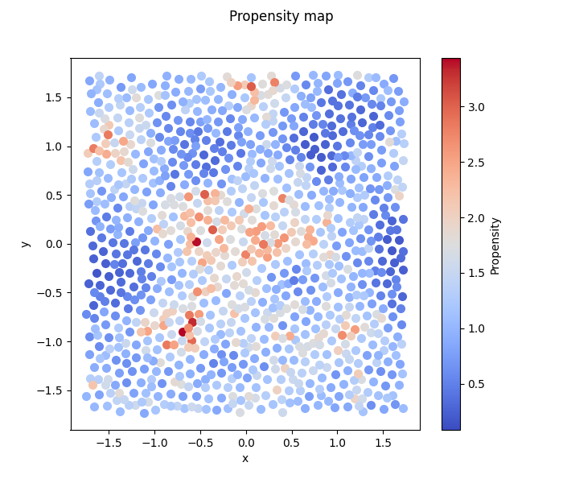

# Structure and Dynamics in Glasses - a Machine Learning approach

## Introduction

The intrigueing behaviour of glassy materials remains a major challenge of statistical physics for decades yet to be demystified.
This mini-project showcases the application of supervised machine learning techniques to an active research area of this domain of physics, namely the study of the relation between microscopic structure and heterogeneous dynamical features in glassy materials.
From a practical perspective, we search an approximation of some unknown, allegedly existing, target function $\varphi(\cdot)$ that maps the local structural environment of a molecule at an arbitrary instance to its travelled distance at a later instance. The local structure enviornment of a molecule is quantified by a $M$ dimensional vector $` \mathbf{x} `$, the components of which are so-called "structure descriptors", and the distance travelled is quantified by a scalar $p$, conventionally called "propensity", measuring the mean-squared-displacement over a purposefully chosen duration of that molecule. Hence, the core practice of this project is to feed machine learning models with input-output pairs $` (\mathbf{x}, p) `$  to aquire the target function $` \varphi(\mathbf{x}) = p `$.

Unlike usual applications fo machine learning, the primary purpose here is not for predicting a molecule's movement based on unseen structural data. The significance is two fold. First, the best generalisation performance that can be achieved by any machine learning approaches itself concept-proves whether the salient dynamical behaviours of glassy materials is actually related to its "featureless" structural. The potential success shall clearly indicate that comprehending deeply information encoded in the structure is a promising direction of glass research. Second, with the approach adopted in this project, one can also expect concrete assessement of which type of structure descriptors (i.e. which features of $` \mathbf{x} `$) are relevant to the dynamics. This shall further narrow the scope of future study on this topic.

Linear regression models and multi-layer perceptrons (MLP neuron-network) are the machine learning models to be studied in this project. Linear regression models have the advantage to be interpretable, provding valuable information for physics. While MLP is not quite interpretable, it is an universal approximator with two benefits. First, by tuning the model flexibility through varying its architecture, one can eventually detect the upper bound of generalisation performance in guessing $\varphi(\cdot)$, which hints the adequacy of assuming such a targect function in first place. Second, with that a linear model can be viewed as a special case of MLP of the least complexity, by comparing the performance of MLP with a linear model, it would become clear to which extend, within the scope of our approach, the physical insights gained from an interpretable linear model are valid.

To gain a more complete presentation of the physics context, please refer to the section ["Problem context"](/README.md#problem-context). Otherwise, skip it to directly dive into the showcase of the machine learning application. The results here presented are generated by python programs and data enclosed in [project](./project/), together with an explatory document [explain.ipynb](./project/explain.ipynb). Python programs should be run from the directory [project](./project/) for loading and saving data correctly with relative paths.

## Problem Context

We are dealing with a problem in an active area of current research in statistical physics of glassy materials. A type of material, such as $\text{SiO}_2$, is glassy when the crystallisation (or more generally called the first order transition, such as water becoming ice) is avoided, bypassed or absent with a changing of its environment, usually a dropping temperature. Instead, these materials vitrify, that is they behave like a liquid but becoming more and more viscous with a decreasing temperature until at some point, they apparently stop flowing and stand there like a solid, which we call glasses. This apparent transition from a liquid to a "solid", allegedly call the "glass transition", is unconventional compared to crystallisation where the microscopic structure changes qualitatively from a disordered one of liquids to an ordered structure of crystals, like FCC, BCC, etc. In a glass transition, the microscopic structure is always disordered seemingly unchanged from a liquid, except that molecules have more and more difficulties to move under thermal aggitation, giving rise to its macroscopic drastic increase in viscosity, so large they apperently stop flowing. Physicists havn't come up with a proper explaination of this phenomenon using elementary concepts and hypothesis in physics for more than half a centry, although splended progress has been made.

Accompanying this dynamical slowing down in a glass transition, molecules move also more and more unevenly over locations and periods (space and time), a phenomenal called "dynamical heterogeneity". It basically states the fact that while particles at some places significantly wonder around over a period of time, particles at some other places vibrate in place like struggling to get out of their cages, and the fact that while any particle could be free to move for some periods of time, the same particle stucks over some other periods of time. This dynamical complexity has a central role in decyferring the glass transition as it is a signature of glassy dynamics.
It has been shown by computer simulations that the levels of mobitiy of particles across an entire system over certain period of time starting from a given moment, say $t=0$, is largely decided only by the configuration at that moment $t=0$. A configuration is specified by the positions of particles in the entire system, denoted $` \{\mathbf{R}_i\}_{1,2,\ldots,N} `$, and the mobility of a particle $i$ is characterized by a quantity called "propensity", denoted $p_i$, where $N$ the number of particles in a system. There are several definitions of propensity used in the literature, but the one we are using here is simply the statistical average of the distance being trevalled by a particle over a duration $\tau_\alpha$, that is the time scale over which the configuration has been significantly changed and directly related with the macrosopic viscosity. Hence the propensity is a positive scalar associated with some particle. An example of molecules' propensity coming from an earlier configuration is illustrated in [Fig.1](/README.md#fig1), generated with ["particle_clustering.py"](./project/PyCode/particle_clustering.py).

#### Fig.1
<picture>
    
</picture>

The strong link between a configuration and the propensity, as evidenced by numerical experiments, indicates that a careful characterisation of this relation may pave the way in demystifying the glass transition. By "careful characterisation", we look for the information encoded in a configuration that is actually relevant to the propensity. A configuration, represented by $` \{\mathbf{R}_i\}_{1,2,\ldots,N} `$, is raw data containing both relevant and irrelevant information for our problem. To name one type of irrelevant information, consider translation of the entire system, which gives rise to a new list $` \{\mathbf{R}'_i\}_{1,2,\ldots,N} `$, but does not affect the propensity of any particle, as implied by the translation invariance of physical laws. The approach we are following in this project, as a physicists' tradition, is to measure physically motivated structure descriptors for each particle based on the relative positions of its surrounding particles. Beacause of the lack of prior knowledge, we include many ($M=96$) structure descriptors for each particle to form a list of structure descriptors $` \{\mathbf{x}_i\}_{i=1,2,\ldots,N} `$ with each $` \mathbf{x}_i \in \mathbb{R}^M `$. The task of "careful characterisation" of the link between configuration and propensity, becomes searching for an approximating function that describes well the relation between $` \{ \mathbf{x} _i \} _{i} `$ and $` \{p_i\}_{i} `$. That is actually a machine learning problem. By applying proper machine learning methods and by comparing machine learning models of different intrinsic properties, we may not only find a reasonable approximate target function, but also hopeful to gain physical interpretations, such as identifying relevant structure descriptors.  A further simplification, which actually carries physical assumptions, is adopted that the propensity of a particle $i$ is only related to its own structure descriptors $` \mathbf{x}_i `$. Hence, instead of searching for a target application between the two list $` \{\mathbf{x}_i\}_i `$ and $` \{p_i\}_i `$, we search for a target function $` \varphi (\cdot) `$ mapping a $M$ dimensional vector $`\mathbf{x}`$ to a scalar $p$, which constitutes the core objective of this project.  

Finally, it is worth emphasizing that whenever we callibrate a model against some data, the actual objective is to optimise the model with respect to certrain distribution underlying that dataset, to obtain a good generalisation for unseen data. Unlike most of real life problem,  for the physical purpose of our problem, the underlying probabilty distribution is theoretically known. Formally, it is the one particle Gibbs-Boltzman weight over the $M$ structure descriptors and the propensity $p$, denoted $` P_\text{GB}(\mathbf{x},p) `$.
This remark suggests us the correct way to use the available dataset to calibrate our models, instead of blindly treating each input-output pair as an independent data point. In other paragraphs of this presentation, the input-output pairs are carefully selected from the raw dataset, so that in either training or validation set, data points can be regarded as independently generated from the Gibbs-Boltzman weight.

## Machine Learning models \& Training Algorithms

After preprocessing the raw data, we end up with in total $N\approx 500$ data points that can be regarded as independently generated from some underlying probability distribution (see [problem context](/README.md#problem-context) for details). Each data point is composed by a input vector $` \mathbf{x} `$ of dimension $M=96$ and a output scalar $p$. This entire dataset will be sparated into training set and validation set for training models and hyper-parameter selection.

For tuning hyper-parameters, a slight variation of the conventional cross validatation method is used. For a given set of hyper-parameters, training and validation are performed $k$ times. In each trial, the entire dataset is randomly splited into a training set and a validation set, with a validation to training ratio $r$. To avoid significant overuse of the data, the product $kr$ is controlled to be $` \gtrsim 1 `$. This method, compared with the nested cross-validation, has the advantage of exploiting better the fluctuations due to training and validation datasets by freely controlling the split ratio $r$ and the number of trials $k$. The final hyper-parameters are tuned against minimisation of the validation error averaged over $k$ trials.

### Linear models

#### A unified view

A linear model for our problem reads
$$\hat{p} = \mathbf{w} \cdot \mathbf{x} + w_0 \quad .$$
There are various approaches based on a linear model, such as empirical risk minimisation (ERM), maximum posterior (MAP) or Baysian inference.
This project adopts a view in which different approaches can be regarded as variations of treatement of the same underlying probabilistic model, that is specified by a graphic representation.
Adopting such an unified point of view has the advantage to compare across different treatments for the same dataset, and as such to assess the validation of treatments as well as the model assumption.
This advantage does come with a price, which requires that the exponential of the negative loss function used in an ERM is normalisable with respect to target value. For example, the absolut distance $`|p_i-\hat{p}|`$ renders $`\int dp_i \exp(-|p_i-\hat{p}|)`$ normalisable.
This constraint may hurt the application in some cases but not ours.

#### Different treatments

The probabilistic model considered here is simply given by a likelihood and a prior $` P_\text{lh.}(p|\mathbf{x};\mathbf{w}) \times P_\text{pr.}(\mathbf{w}|\theta) `$, and data points are considered (conditionally) independent from each other for a given $`\mathbf{w}`$.
We will consider the standard Gaussian likelihood
$$ P_\text{lh.} \propto \exp\left( -\frac{1}{2}\beta(p_i-\hat{p})^2 \right) $$
which is equivalent to considering a summed square loss function. We will consider two types of prior on the feature weights $` \mathbf{w} `$, namely a $\ell_1$ norm and a $\ell_2$ norm, that is
$$ P_\text{pr.} \propto \exp(-\lambda\ell_1(\mathbf{w})) \equiv \exp(-\lambda \sum_{\alpha}|w_\alpha| ) $$
and
$$ P_\text{pr.} \propto \exp(-\lambda\ell_2(\mathbf{w})) \equiv \exp(-\lambda \sum_{\alpha}w_\alpha^2 ) \quad .$$
One easily sees that, with either prior choice, MAP and ERM (equiped with a $\ell_1$ or $\ell_2$ regularisation) become equivalent in this setting and the training results only depends on $` \tilde{\lambda}\equiv \lambda/\beta `$.
Conventionally, it is called Lasso regression when appplying MAP with a $\ell_1$ regularisation and Ridge regression when applying MAP with a $\ell_2$ regularisation. 
We will call them "MAP-Ridge" and "MAP-Lasso" to be distinguished from Bayesian treatment of the same probabilistic models, which will be called "Bayes-Ridge" for example.
"Bayes-Lasso" is not studied here, because of the numerical integration challenges raised by our particular dataset.
In Bayes-Ridge, hyper-parameters ($\beta$ and $\lambda$) are determined by maximising the marginal likelihood (also called "model evidence"), in which, after short manipulation, the training results can also be considered to only depend on $\tilde{\lambda}$. 

MAP-Lasso is known for its sparsity in training results, which is particularly useful for selecting relevant features, such as one of the core purposes of this project. It is however also known for its tendency to over reduce the amplitude of the selected weights. To address this issue, we introduces also the debias treatment, called "MAP-Debias". Namely, we will perform a MAP-Ridge all over again on the same data, but with only the features seleceted by the optimal MAP-Lassso model.

Hence, we perform four different treatments with a linear model, that are

1. **MAP-Ridge**
2. **MAP-Lasso**
3. **MAP-Debias**
4. **Bayes-Ridge**

The expected loss (or risk, or negative log likelihood(nll)) for each of above treatment are exibited as a function of $\tilde\lambda$ to tune the hype